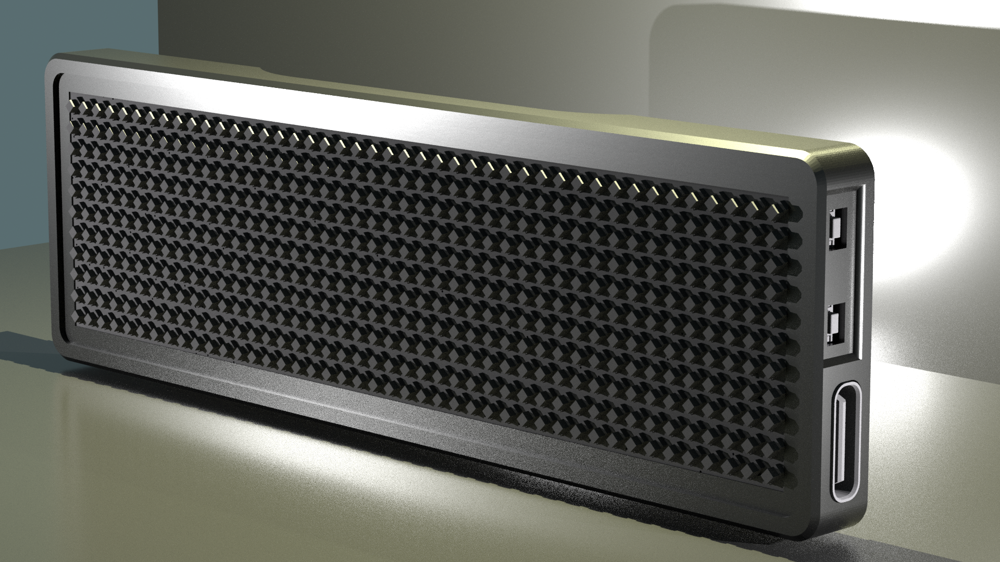
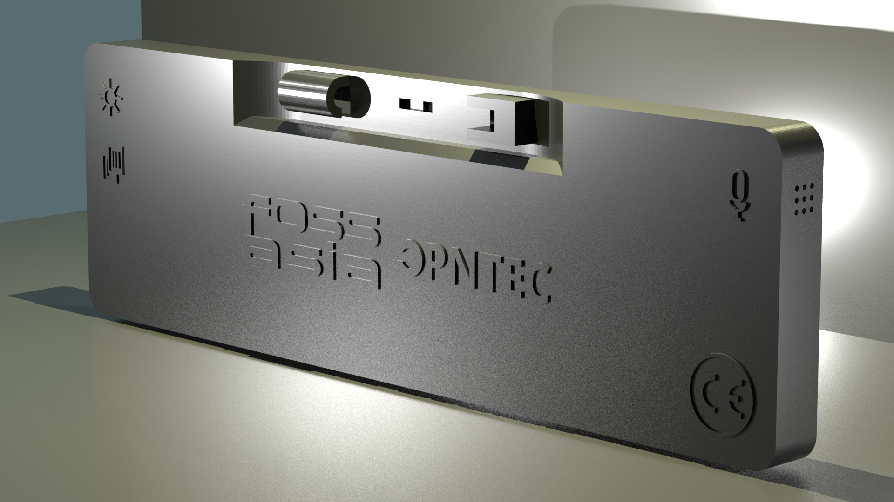
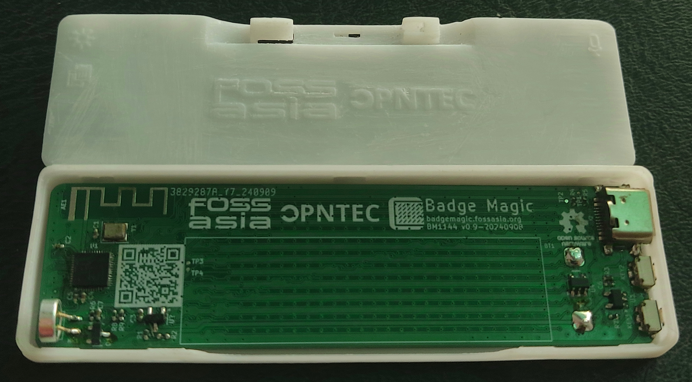
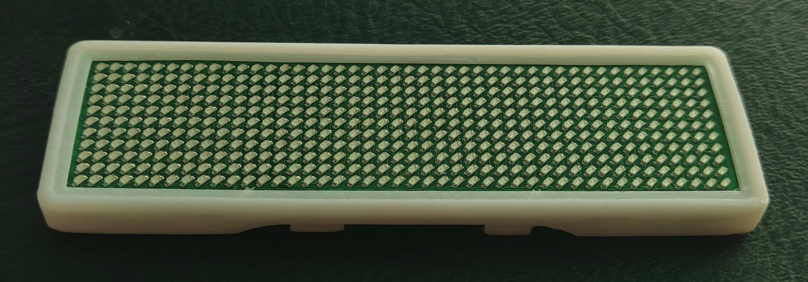
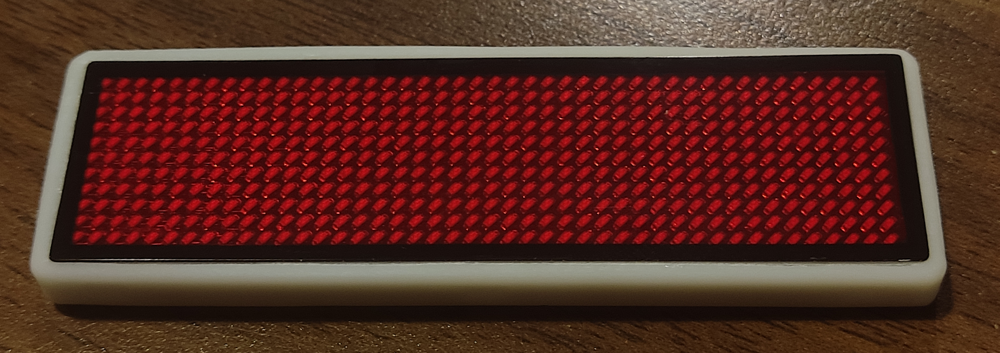

# badgemagic-case

This repository contains the [Badge Magic](https://badgemagic.fossasia.org) LED
casing design files.

## Related Repositories

- Firmware: <https://github.com/fossasia/badgemagic-firmware>
- Hardware: <https://github.com/fossasia/badgemagic-hardware>
- Android app: <https://github.com/fossasia/badgemagic-android>
- And [other repositories](https://github.com/fossasia/?q=badgemagic).

## Buy Device

You can get a board at the [FOSSASIA Shop](https://fossasia.com).

## Tools

[FreeCad](https://www.freecad.org/downloads.php)

## Images

### Rendered image

### Printed case

Printed case with resin printer:

